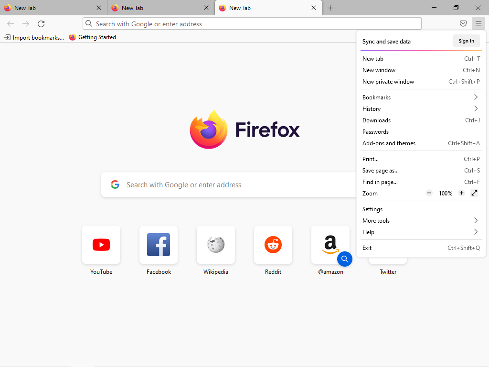
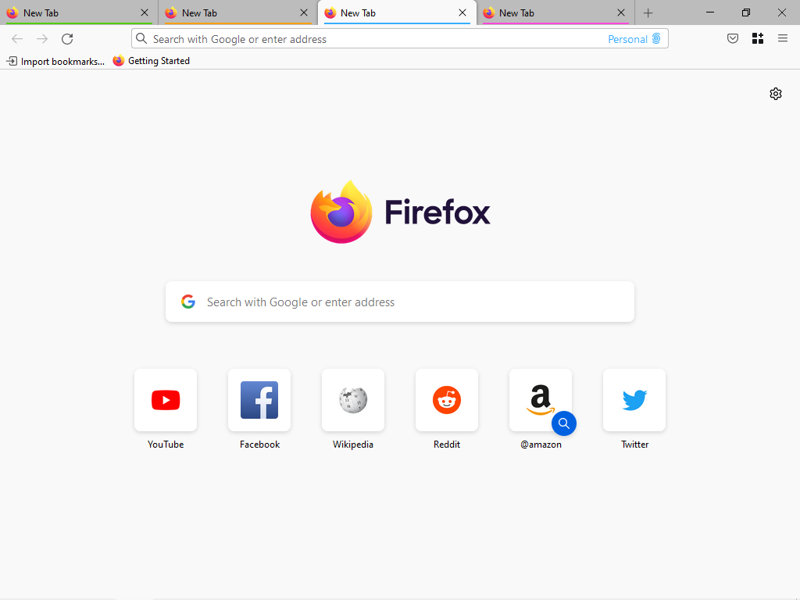

# neutral-compact
A light compact Firefox CSS theme with normal (pre-“Proton”) tabs and strictly neutral gray colors without a bluish tint.

Prerequisites: light theme + compact mode (to see it in *More tools > Customize toolbar > Density,* set pref ```browser.compactmode.show``` to ```true```)

Dark theme colors are not replaced.



Multi-Account Containers indicators have been moved back down for better visibility.


